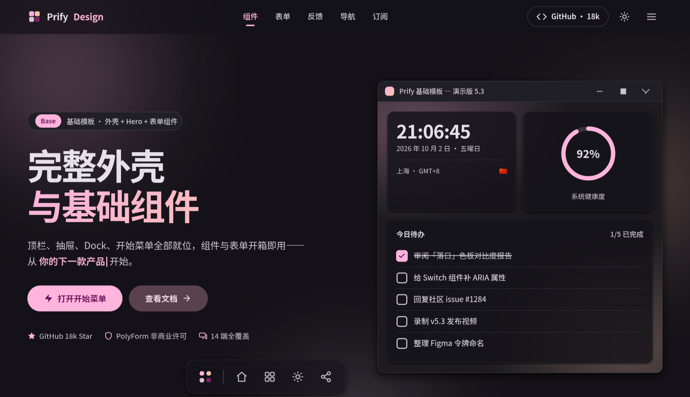

# Prify Design 模板使用文档

Material You × Win11 Fluent Design 融合风格的中文静态网页模板，无构建、无外部网络资源，双击 HTML 或起个静态服务器就能跑（Markdown 页的 3 个解析库与代码字体已随包本地化，离线可用）。



> *声明：示例中的制作人员、数据、链接、邮箱与图片等（包括 GitHub 星数）均为虚构，仅用于功能演示。*


---

## 1. 文件构成

| 文件 | 作用 |
|---|---|
| `base.html` | 基础模板页：完整外壳 + Hero + 表单 / 反馈 / 导航组件 |
| `widget.html` | 小组件模板页：无外壳纯内容（桌面窗口、小组件、图表、统计） |
| `md.html` | Markdown 渲染页：只读展示，左侧目录 + 脚注 + 代码高亮，文档写在页内 `#mdSource`，可在页面上打开本地 .md |
| `prify.css` | 全部样式（三页共用），末尾有 `base.html 专属` 块 |
| `prify.js` | 全部交互（三页共用）：主题、抽屉、开始菜单、对话框、图表等 |
| `icons.js` | SVG 图标库，47 个 `<symbol>`，内嵌 SMIL 动画，运行时注入 |
| `marked.umd.js` | Markdown 解析器 marked v18，MIT，`md.html` 用 |
| `marked-footnote.umd.js` | marked 脚注扩展，MIT，`md.html` 用 |
| `highlight.min.js` | highlight.js 语法高亮整包（36 种语言），BSD-3-Clause，`md.html` 用 |
| `jetbrains-mono-400.woff2` `-700.woff2` | 内置等宽字体 JetBrains Mono（latin 子集，OFL-1.1），`md.html` 代码用 |
| `jetbrains-mono-OFL.txt` | JetBrains Mono 的 OFL 许可原文（OFL 要求随字体分发） |
| `licenses/` | 第三方库许可全文（marked / marked-footnote / highlight.js） |
| `LICENSE` | 本项目许可：PolyForm Noncommercial 1.0.0 + 署名要求 |
| `.gitignore` | 忽略本地备份与测试用文件 |

---

## 2. 快速开始

无需安装任何依赖，把所有文件放在同一目录即可。

方式一，直接双击打开：

- `base.html` —— 完整外壳的基础模板
- `widget.html` —— 无外壳的小组件模板
- `md.html` —— Markdown 渲染模板

方式二，起一个静态服务器（推荐，避免个别浏览器对 file:// 协议的限制）：

```bash
cd 项目目录
python3 -m http.server 8080
```

然后浏览器访问：

- http://127.0.0.1:8080/base.html
- http://127.0.0.1:8080/widget.html
- http://127.0.0.1:8080/md.html

`python3 -m http.server` 对改动是实时生效的，改完 HTML / CSS / JS 刷新即可，不用重启。

---

## 3. 三个页面怎么选

- **只想要一套能直接改的页面骨架** → `base.html`（顶栏、抽屉、Dock、开始菜单、表单、反馈、导航、CTA 全齐）
- **只要小组件 / 图表展示，不要外壳** → `widget.html`（无导航、无抽屉、无页脚，纯内容区）
- **写文档 / 展示 Markdown** → `md.html`（改页内 `#mdSource` 的文本即可，支持表格、任务列表、脚注、代码高亮，也可在页面上打开本地 .md）

各页互不添加导航入口链接，是并列的独立模板。图标清单查 `icons.js` 里的 `<symbol id="i-xxx">`。

---

## 4. 拿模板改自己的页面

### 4.1 引入顺序（必须遵守）

```html
<head>
  <meta charset="UTF-8">
  <!-- 防闪主题色内联脚本，必须留在 <head> 里 -->
  <script>…</script>
  <link rel="stylesheet" href="prify.css">
</head>
<body>
  <!-- 图标库先注入 -->
  <script src="icons.js"></script>
  …页面结构…
  <!-- 交互脚本最后、</body> 前，不用 defer -->
  <script src="prify.js"></script>
</body>
```

原因：

- 防闪脚本在 CSS 解析前应用主题色，挪出去会首帧闪白
- `icons.js` 必须先于 `prify.js`，后者依赖它注入的 47 个 symbol
- `prify.js` 不能加 `defer`、不能放进 `<head>`，它要同步访问 body 里的元素

### 4.2 以 base.html 为底改

直接复制 `base.html` 改内容即可。外壳（顶栏 / 抽屉 / Dock / 开始菜单 / 对话框 / Snackbar / FAB / 页脚）都在文件里，去掉不需要的分区不影响其余功能。

分区锚点：`#components` `#forms` `#feedback` `#navs` `#cta`，页内链接全部指向这些锚点。

### 4.3 以 widget.html 为底改

`widget.html` 是无外壳纯内容页，但**必须保留 `#boot` + `#pageLoader`**：Hero 窗口在 `body.ready` 之前是透明的，启动流程与防闪依赖这个结构。

### 4.4 以 md.html 为底改

`md.html` 同样无外壳，渲染整篇文档只需要改一处：`<script type="text/markdown" id="mdSource">` 之间的文本（支持 GFM 表格 / 任务列表 / 脚注 / 围栏代码块，写法见页内示例）。

- 标题锚点和左侧目录由页内脚本自动生成（h2/h3），marked v18 不产出标题 id，不用手动加
- 代码块标注 `语言` 才高亮，不标注保持原样；代码字体是内置的 JetBrains Mono（latin 子集），中文回落 `--font`
- 顶部「打开 MD 文件」按钮可选本地 .md 即时渲染（http 与 file:// 都可用），文档名与页签标题同步更新，打开结果给一条 snackbar 提示
- 任务列表 `- [x]` 自动改写成 prify 的 `.m3-check` 复选框样式，锁定只读不可点
- 脚注标签建议用 ASCII（如 `[^note]`），中文标签的锚点编码在不同浏览器里行为不一
- 库加载失败时自动降级为纯文本源码展示，页面不会空白

### 4.5 样式和脚本往哪放

| 页面 | 新增样式 | 新增脚本 |
|---|---|---|
| base.html | `prify.css` 末尾的 `/* ===== base.html 专属 ===== */` 块 | `prify.js` |
| widget.html | 自己文件内的 `<style>` | 自己文件内的 `<script>` |
| md.html | 自己文件内的 `<style>`（md 专属样式） | 自己文件内的渲染脚本 |
| 新页面 | 看它有没有外壳：有 → 仿 base；无 → 仿 widget，样式脚本全内联 | 同左 |

---

## 5. 常用功能速查

### 5.1 图标

```html
<svg class="icon"><use href="#i-bell"/></svg>
```

图标名清单查 `icons.js` 里的 `<symbol id="i-xxx">`。全部 47 个，命名 `i-前缀`。

- **动画总开关**在 `icons.js` 顶部：`AUTOPLAY`（加载时全屏自动播）、`ANIM`（是否注入 SMIL），改这两个常量即可，不用动 symbol
- **点击重播**由 `prify.js` 全局处理：点击时把该 `<use>` 就地展开成独立副本再 `beginElement()`，只播被点的那一个

### 5.2 主题与色板

- `html[data-theme]` 切深浅色（`light` / `dark`），`html[data-palette]` 切 20 色板：`violet` 紫罗兰 / `ocean` 海洋 / `forest` 森林 / `sunset` 落日，外加 16 套扩展 `crimson` 绯红、`brick` 砖橙、`rose` 玫粉、`magenta` 品红、`orchid` 兰紫、`indigo` 靛蓝、`azure` 天蓝、`cerulean` 湖蓝、`teal` 青碧、`jade` 竹青、`lime` 青柠、`sprout` 嫩芽、`lemon` 柠黄、`gold` 鎏金、`sand` 暖沙、`neutral` 中性灰
- 再加色板：`prify.css` 色板区补浅色 + 深色两条规则，`prify.js` 的 `PALETTES` 加一行 `{ key, name, dot }`，页脚与抽屉的圆点自动出现
- 系统强调色：抽屉「动态取色」区与页脚色板行最前面的 30×30 圆钮，`.icon-btn.tonal` + `#i-devices` 电脑图标，悬停出 `data-tip` 气泡，带 `data-sys-accent`；按下才读浏览器 `AccentColor` 系统色（探针 + 对照两个隐藏元素，判断关键字是否真被支持），把读到的颜色按紫罗兰 19 个令牌模板现算成浅色 + 深色整套令牌注入 `<style id="sys-palette">`，读到的色**直接涂在这个圆钮自己身上**（`.swatch` + `--c`/`--on-c`，图标色按对比度取黑或白），色板圆点区**不新增圆点**，色值存 `prify-system-accent` 下次直接复用；当前 `data-palette="system"` 时该钮带选中圈，点任意静态色板圆点即退出（`data-palette` 一变，系统规则就不匹配）。读不到、或色过于中性（近黑/白/灰）只提示不改色
- 调色盘：抽屉与页脚「动态取色」行的调色盘圆钮（`.icon-btn.tonal` + `#i-palette`，带 `data-color-pick`）打开居中弹窗 `#pickerWrap`（打开时自动收起抽屉 / 开始菜单）；取色区是一个二维面（横轴饱和度、纵轴明度，底色随色相），上方白色圆环光标可按住拖动，下面一条彩虹色相滑杆（原生 range 换皮成白色圆角滑块），底部是圆形色块 + 可编辑的十六进制输入 + 随机按钮。三者用 HSV 合成 `_hsv2hex()` 基础色，复用 `sysBuildPalette()` 现算整套令牌。**拖动时只在弹窗内预览**（光标 / 色块实时变，弹窗外的页面不重绘，避免卡顿），松手 / 改 hex / 随机时才整页换色一次；注入独立 `custom` 槽（`html[data-palette="custom"]`），取消 / Esc / 点遮罩还原打开前的色板，点「应用」才写 `prify-custom-color` 与 `prify-palette`，**色板行同样不新增圆点**，颜色改涂在调色盘圆钮自己身上（`paintSwatch`，`data-palette="custom"` 时它带选中圈，和 i-devices 钮上的系统色互不覆盖）；颜色太接近黑 / 白 / 灰（算不出整套）会禁用应用并提示
- 浏览器限制（按钮不会坏，但不一定真的"跟了系统"）：`AccentColor` 需要较新版本，Chrome 150+ 普通标签页为防指纹只返回固定默认蓝（会提示「可能是浏览器固定默认色」），Safari 长期返回常量，真正拿到系统真值的主要是 Firefox（Windows 除外）与已安装的 PWA
- 存 localStorage（`prify-theme` / `prify-palette`），下次访问保持
- 顶部主题按钮、Dock 深浅按钮、色板点都会联动

### 5.3 对话框（全页单例）

```js
setDialogContent({ title: '标题', desc: '描述', icon: '#i-sparkles', ok: '确定' });
setDialog(true);   // 打开
setDialog(false);  // 关闭
```

`#dialogWrap` 放在 body 末尾即可复用，页面上有 `#dlgBtn` 会自动绑定。

### 5.4 Snackbar（全页单例）

```js
snackbar('已保存', '撤销', () => { … }, 3600);
```

参数：文本、动作按钮文字（可选）、回调（可选）、时长毫秒（默认 3600）。

### 5.5 状态类名

- 入场：`.reveal` / `.stagger` 进入视口自动显现（配 `.in`）
- 数字与圆环：`data-count="92"`（计数）、`data-ring="92"`（圆环），**只在 `.reveal` / `.stagger` 祖先进入视口时才填充**
- 折线图：滚到视口由 IO 加 `.line-chart-wrap.chart-in` 触发绘制

---

## 6. 新增一个页面的检查清单

1. 复制 `base.html`（要外壳）或 `widget.html`（不要外壳）
2. 改 `<title>`、`<meta name="description">` 和页面文案
3. 页内链接只指向本页真实存在的锚点
4. 确认 `#boot` / `#pageLoader` 还在，`icons.js` 和 `prify.js` 顺序正确
5. 跑一遍检查（见第 7 节）

---

## 7. 自测要点

改完代码至少过这几项：

```bash
node --check prify.js icons.js        # JS 语法
python3 -c "s=open('prify.css').read();print(s.count('{'),s.count('}'))"   # 括号配平
curl -s -o /dev/null -w "%{http_code}\n" http://127.0.0.1:8080/base.html   # 资源 200
```

肉眼检查清单：

- 加载无白屏 / 无主题闪色，boot 启动画面正常淡出
- 顶栏、抽屉、Dock、开始菜单、对话框、Snackbar 都能开能关
- 主题 / 色板切换，刷新后保持
- 图标入场自动播，点击单个图标只重播它自己
- 图表滚到视口才画，柱状图 X 轴标签、圆环数字正常
- 对话框内容依次淡入，开始菜单下半部分（搜索框、推荐、页脚）完整
- 徽章红点里的数字居中
- md.html：目录点击跳转、滚动时目录高亮跟随、代码配色随主题切换、脚注往返、表格窄屏横向滚动、打开本地 md 可渲染

---

## 8. 踩坑速记

- **入场关键帧必须写显式 `to`**：元素基础 `opacity:0` 配 `from{opacity:0}` 会 0 淡入到 0 永远不显示
- **小尺寸徽标写 `line-height:1`**：body 的 1.7 行高会撑破固定高度内容框，文字不居中
- **写入型 id 契约**：`dlPct / dlBar / radiusOut / radiusSlider` 四个要么全带要么全不带，缺 `radiusSlider` 页面会显示 `undefined%`
- **下拉菜单 `#teamList` 由 JS 挂到 body**（fixed 定位），别放回 `.win-card` 里，会被 `overflow:hidden` 裁掉
- **图标动画是 SMIL**，不受 `prefers-reduced-motion` 影响，也不按视口触发
- `$()` 找不到元素返回游离 div 不抛错，所以 id 拼错不会报错，靠上面第 7 节的比对来查
- **marked v18 没有 headerIds**：md 页的标题锚点与目录由页内脚本手动生成
- **md 页脚注标签用 ASCII**：marked-footnote 对 id 与 href 都做 URI 编码，中文标签的锚点匹配在不同浏览器里不一致

---

## 9. 第三方库与许可

`md.html` 依赖 3 个库 + 1 个字体，全部已下载到同目录、离线可用，无 CDN、无构建步骤：

| 库 / 资源 | 版本 | 许可 | 用途 |
|---|---|---|---|
| [marked](https://github.com/markedjs/marked) | 18.0.14 | MIT | Markdown → HTML 解析（GFM） |
| [marked-footnote](https://github.com/bent10/marked-extensions) | 1.4.0 | MIT | 脚注扩展，挂载到 marked |
| [highlight.js](https://github.com/highlightjs/highlight.js) | 11.11.1 | BSD-3-Clause | 语法高亮（使用 cdn-release 整包 `highlight.min.js`，含 36 种语言） |
| [JetBrains Mono](https://github.com/JetBrains/JetBrainsMono) | 2.x latin 子集 | OFL-1.1 | 代码等宽字体（woff2） |

许可全文随包：`licenses/marked.LICENSE`、`licenses/marked-footnote.LICENSE`、`licenses/highlightjs.LICENSE`，字体许可见 `jetbrains-mono-OFL.txt`。

注意：highlight.js 许可是 **BSD-3-Clause 不是 MIT**；`npm i highlight.js` 装的 `lib/common.js` 是 ESM 聚合入口，`<script>` 引不进来，必须用发布产物整包。JetBrains Mono 是 OFL-1.1，分发时要附带许可原文且不得使用其保留字体名；它是 latin 子集，中文注释回落到 `--font`。

除 `md.html` 外，其余页面不引入任何第三方库，样式交互全部为 `prify.css` / `prify.js` 原生实现。

---

## 10. 授权与商用

本项目（`base.html` / `widget.html` / `md.html` 与 `prify.css` / `prify.js` / `icons.js`）采用 **PolyForm Noncommercial License 1.0.0**，全文见 `LICENSE`。要点：

- **非商业**使用、复制、修改、分发免费，但必须保留版权声明与许可声明，并在适当位置注明原作者 **wfy-coder**。
- **商业用途**须事先取得版权持有人的书面授权，可通过 https://github.com/wfy-coder 联系。
- 软件按“现状”提供，不含任何担保。

第三方库与字体遵循各自许可（见第 9 节），与上述条款彼此独立。


